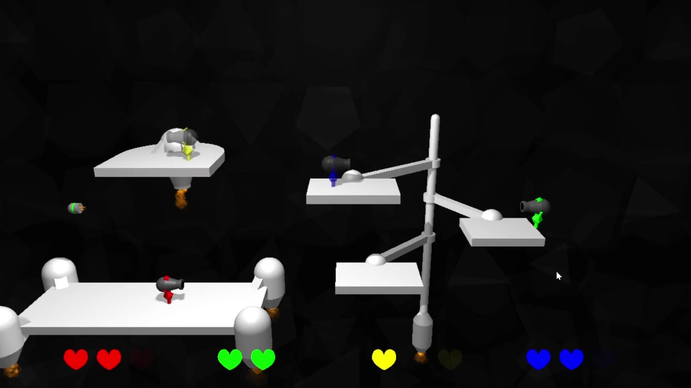
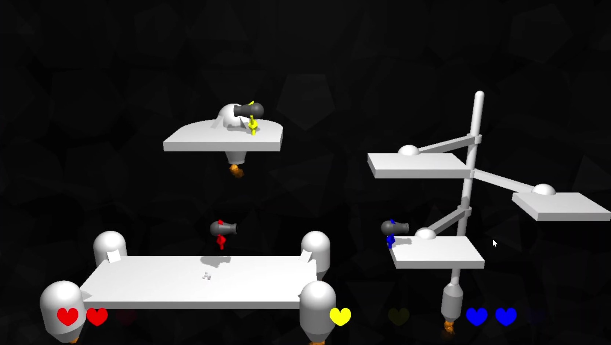

# 🔫 Canon Jumper
Simple local multiplayer 2.5D (2D gameplay with 3D graphics) game made in JavaScript with three.js. Must be run locally with a python server. Goal of the game is to shoot other players off floating platforms.

## 📷 Screenshots

---

**Krystof Hruby 2022, 2023**
